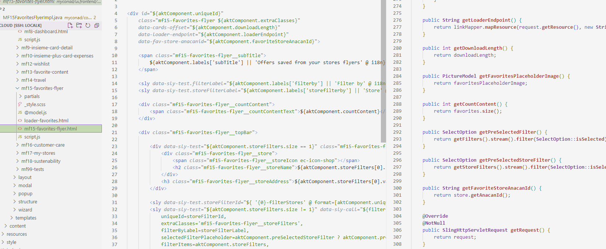

# FE AEM Server

An nodeJS express server created to develop HTL AEM components directly on the frontend.


## Why?

The flow that I personally followed in many projects was that FE developers created the code using template engines typical of their world (HBS, Nunjucks, Pug and etc...). Next, in the AEM world, I had to convert their components to HTL to integrate with AEM.

Obviously this flow involves three big problems:

1. Every change to the FE HTML must be integrated on the AEM side, even the most easy ones, such as adding a class. This obviously **leads to misalignments between the two worlds.**
2. The FE templates support instructions such as _slots_ or others that do not exist as a concept on the HTL side, this leads to a drift of the components as 1 component on the FE side no longer corresponds to 1 component on the AEM side but perhaps to multiple components and/or multiple templates.
3. In an ideal world who develops on AEM he is a true full stack developer and therefore knows how to both program on AEM and FE, and develops everything via core-components. But in practice the two figures are often identified with a standard FE developer (who doesn't know about AEM and doesn't want to know, who usually use react) and a Java developer who is forced to also know HTML.

The solution I wanted to undertake with this project is that the FE developer already uses the HTL templating language for the development of his own code and that the HTL he generates **does not require any modification** to be used on AEM.

In this way, those who work on AEM only deal with Java and providing data, and those who work on the FE side deal with the graphics and logic of the various components using the FE framework that prefers.
Their communication is reduced to a series of data that must pass from one to the other via standard objects that both know, like an API on SPA.


### How it works?

The system provides a web-server on the FE side integrated directly with webpack/vite which is used as an alternative to the classic dev server.
The web server simulates an AEM HTL rendering server on FE side using the @adobe/htl-engine.

## 0 - Install

```bash
// install fe-aem-serve
npm install --save-dev @kele23/fe-aem-server
```

## 1 - Structuring project

Since the idea is that the components must not undergo transformations when moving from FE to AEM, the FE must follow some simple rules of an AEM project.

So a project using this system must organize the components as a developer would on AEM:

```
.
|
├── package.json
├── ... other stuffs
|
├── repository
    ├── apps
    |   └── my-project
    |       └── components
    |           ├── text
    |           |   ├── text.html
    |           |   └── @model.js //see @model section
    |           ├── ...
    |           └── image
    |               ├── image.html
    |               └── include.html
    |
    └── content
        └── my-project
            └── us
                └── en
                    ├── index.json
                    └── company.json
```

As you can see above, the FE components must all be placed in a repository folder and structured hierarchically like on AEM.
The name of the component's HTML file, similarly to what happens on AEM, must also be called the name of the component itself.
It is then possible to add further html files which can then be included and/or used in the components.

The contents must also be inserted into the repository.

## 2 - Rendering

The content, as for AEM, is the center from which all rendering starts.
Each content contains a "resourceType" which tells the system which component to use for rendering it.

Not knowing if everyone knows how AEM / Sling works, I refer you to this section:
https://experienceleague.adobe.com/docs/experience-manager-65/developing/platform/sling-cheatsheet.html?lang=en
to better understand the basic function of AEM URL decomposition and rendering.
Webpack AEM server basically uses the same concept that AEM also uses.

_In short:_
URL is converted into resource, which through resource type identifies a component that is used to render the resource itself.


## 3 - Components

As you can expect the HTML of the components is HTL, here is an example of a Hero component created with tailwindcss and alpinejs.

```html
<sly data-sly-use.model="@hero-model.js"></sly>
<sly data-sly-use.t2="../../../templates/t2-dropdownfield/t2-dropdownfield.html"></sly>

<div id="$id['hero']" class="" x-title="c1-hero" x-data x-init="console.log('I\'m being initialized!')">
    <div class="hero-content text-center">
        <div class="max-w-md">
            <h1 class="text-5xl font-bold">${model.title}</h1>
            <div class="py-6 prose">${model.text @ context='html'}</div>
            <sly data-sly-test.link="${model.link}">
                <a data-sly-attribute="${link}" class="btn btn-primary">${link.label}</a>
            </sly>
            <sly data-sly-call="${t2.render @ label=model.dropdownLabel, items=model.dropdownItems}"></sly>
        </div>
    </div>
</div>
```

### Bindings

As with standard AEM, here too there are some objects, bindings, that can be used directly in HTML.

These are:

1. **properties**: Current properties of the rendered resource
2. **pageProperties**: Current page properties
3. **resource**: The current rendering resource
4. **resourceResolver**: The current resourceResolver
5. **wcmmode**: The wcmmode, always disabled
6. **request**: The current request

In practice, you already have everything you need to create simple editorial components.

### Models

Yes, it is also possible to use models here, obviously only JS, and call them via the `data-sly-use` instruction.

The JS syntax of a model is very similar to that of the corresponding JS model on the AEM side ( JavaScript Use API ). This is an example:

```js
/*global use*/
use(['../../../../_models/@link.js'], function (link) {
    var title = this.properties['usePageTitle'] ? this.pageProperties['jcr:title'] : this.properties['title'];

    return {
        ...this.properties,
        title,
        link: link.makeLink(this.properties['link']),
        dropdownLabel: 'Select',
        dropdownItems: [
            {
                label: 'Test2',
            },
        ],
    };
});
```

Personally I think that the use of JS in a Java world doesn't make much sense and in fact this way of creating models in JS within AEM has never been used by me in a real AEM project. Right now, if I look for the HTL documentation for the JS Use Api I find very little in the Adobe documentation, where the use of the Java Use API is highly recommended.

This is obviously a big problem, how can we on the FE side simulate a Java model if we don't have Java? Especially if we want to maintain the idea of simply copying the HTL code and everything must work, how can I do it in such a way as not to keep changing the address of the `data-sly-use` beetween JS style ( simple path ) and Java Style ( PID )?

To do this the system provides a further binding called "model" (the name can be customized via configuration) which therefore makes access to a model available without the use of data-sly-use. The model in question must necessarily be called `@model.js` and must be inserted inside the component folder.

In this way, if on the standard AEM side you add a `data-sly-use` that creates this model as the first line of a component, or you add this binding to all our components by a custom service, the HTL code between the two worlds remains perfectly aligned.

_Example of real project where "aktComponent" binding is added on AEM Side automatically by custom binding service_:



## 4 - Running

Running this system is easy as running the standard webpack-dev-server / vite-project:

```bash
fe-aem-server --webpack-config conf/webpack.dev.js --server-config conf/server.config.js
fe-aem-server --vite-config conf/vite.js --server-config conf/server.config.js
```

The difference is that an additional configuration file called "server-config" must also be provided.

This an example of that configuration:

```js
const path = require('path');
const src = path.resolve(__dirname, '.');

module.exports = {
    hotComponents: true, // enable hot components reload ( see components hot reload section)
    contentRepos: [
        // content repos, a list or resource providers
        {
            rootPath: '/',
            localPath: path.resolve(src, 'repository'),
            type: 'file',
        },
        {
            rootPath: '/content/remote',
            type: 'remote',
            aemRemote: 'http://localhost:4502/content/remote',
            options: {
                urlFn: (remote, cleanedPath, level) => {
                    return `${remote}${cleanedPath}.aktrend.${level}.json`;
                },
                request: {
                    authorization: 'YWRtaW46YWRtaW4=',
                },
            },
        },
    ],
    proxies: [
        // proxy to backend AEM or other apis
        {
            middlewarePath: '/api',
            target: 'http://localhost:4502/api',
            changeOrigin: true,
            auth: 'admin:admin',
            logLevel: 'debug',
        },
    ],
    modelAlias: ['model'], // the name to automatically model binding
};
```

The most important configuration of course is `contentRepos`.
This section specifies a list of providers that provide the system with the resources necessary for working, whether they are contents (pages) or components.

By default there are three types of providers (also called RepoReaders in the project):

1. **file**: Obtains resources from the file system
2. **remote**: Obtains resource from a remote AEM instance
3. **custom**: You have to provide your function to provide contents to the system

For the moment only the "file" typology supports the provision of code for components as the HTL Engine used requires absolute paths in the local file system to function correctly. The other types, however, can easily support the provision of page content.

Not having the time to write super accurate documentation, for the moment to understand how to create the JSON of the contents (for the _file_ provider) and/or the possible reuse of the contents, please refer to the example in the `test` folder.

### 5 - Components HOT Reload

FE AEM Server was built using HRM ( https://webpack.js.org/concepts/hot-module-replacement/ and standard vite HRM ) to improve and speed up FE development. In addition to that system, a very similar sistem can also be enabled for the HTML components present on the page.

By setting the `hotComponents` flag to `true`, a script will be embedded in the page which, when a resource is modified, reloads only the single component.
This is all done by "dirtying" a little the final generated HTML code by adding meta tags to keep track of where a component ends and/or begins.


## NOTES

_Is this a perfect solutions for every AEM components?_

No, I don't think so. FE AEM server is very usefull where you have to create a standard MPA in AEM and you want to have a better FE development experience.
